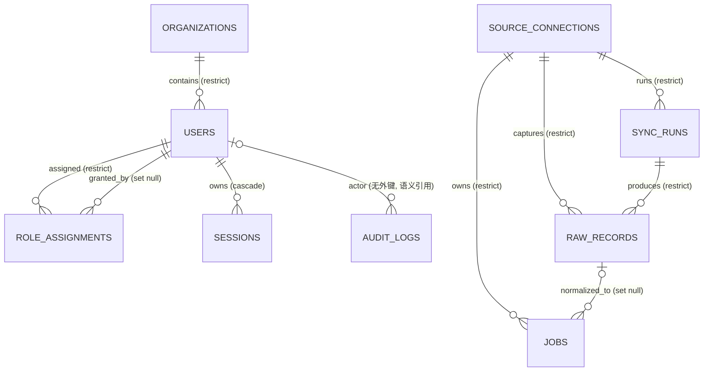

# 数据模型

本文件是数据库表结构、表关系、约束、保留与迁移的唯一权威来源。可执行真源为 [`apps/web/db/schema.ts`](../apps/web/db/schema.ts) 与 [`apps/web/drizzle/`](../apps/web/drizzle/) 迁移；发现冲突先修正本文件，再改 schema 与测试。

> 直观速览：当前已落库 **9 张表**（身份域 5 + 数据域 4）+ 6 个枚举；另有 **14 张规划表（M2–M4，尚未落库）**，见 [§2 表清单](#2-表清单与实现状态) 与 [§8 规划表](#8-规划表m2m4未落库)。

## 1. 目标与非目标

- **目标**：数据底座可重复同步并查询沉睡职位与候选人；身份/会话/角色可审计；原始载荷加密、规范化可追溯、保留可配置。
- **非目标**：M2 前的摘要/匹配/触达/落地页表不落库；不做消息队列（MVP 用数据库任务表语义）；不做向量库。

## 2. 表清单与实现状态

### 2.1 已落库（迁移 0000–0002，共 9 张）

| 域 | 表 | 一句话职责 |
|:---|:---|:---|
| 身份 | [`organizations`](#51-organizations) | 企业/团队边界，为多租户预留 |
| 身份 | [`users`](#52-users) | 管理端本地账号，保存 bcrypt 口令哈希，不含明文口令 |
| 身份 | [`role_assignments`](#53-role_assignments) | `operations/recruiter/admin` 角色分配 |
| 身份 | [`sessions`](#54-sessions) | 服务端可撤销会话，只存令牌哈希 |
| 身份 | [`audit_logs`](#55-audit_logs) | 追加写操作审计，禁含敏感正文 |
| 数据 | [`source_connections`](#61-source_connections) | 外部连接元数据，不保存明文密钥 |
| 数据 | [`sync_runs`](#62-sync_runs) | 同步批次与游标 |
| 数据 | [`raw_records`](#63-raw_records) | AES-256-GCM 信封加密的原始载荷快照（追加写） |
| 数据 | [`jobs`](#71-jobs) | 规范化职位；公司名/详细地址不进公开视图 |

### 2.2 规划表（M2–M4，未落库）

`job_requirements`、`candidates`、`candidate_profiles`、`candidate_contacts`、`match_rules`、`matches`、`match_dimensions`、`campaigns`、`campaign_recipients`、`landing_links`、`intent_responses`、`funnel_events`、`follow_up_tasks`、`recommendations`。字段草案见 [§8 规划表](#8-规划表m2m4未落库)，落地前必须先回写本文件再写迁移。

## 3. 通用存储约定

- **标识与时间**：主键统一 UUID（`gen_random_uuid()`）；时间统一 `timestamptz`，服务端 `now()` 写入。
- **枚举**：`connection_environment`（`development|test|production`）、`connection_status`（`disabled|active|error`）、`sync_run_status`（`pending|running|succeeded|failed`）、`raw_record_status`（`captured|normalized|invalid`）、`user_role`（`operations|recruiter|admin`）、`user_status`（`active|disabled`）。
- **JSON 使用限制**：`jsonb` 仅用于结构白名单——`sync_runs.stats`（计数）、`jobs.eligibility_evidence`（供应商筛选证据）、`audit_logs.metadata`（白名单元数据）。禁止把外部完整响应或敏感正文塞进 JSON。
- **删除与审计**：`audit_logs` 只追加、不允许应用角色更新；保留任务按策略删除并记录自身审计事件。

## 4. 领域关系



**所有权说明**

- **身份域**：`users` 属于 `organizations`；会话随用户级联删除；角色撤销用 `revoked_at` 置位而非删除，保证审计可回溯；`audit_logs.actor_id` 对 `users` 是**无外键的语义引用**（actor 可能已被删除，审计事实必须保留）。
- **数据域**：`source_connections` 是同步聚合根，`sync_runs`/`raw_records`/`jobs` 都指向它，删除一律 `RESTRICT`（不允许删掉有历史数据的来源）。`raw_records` 是追加写的原始快照；`jobs` 通过 `raw_record_id` 可追溯到产生它的原始记录，删除原始记录时置空（`SET NULL`）而不级联删职位。

## 5. 身份域表

### 5.1 `organizations`

| 字段 | 约束与语义 |
|:---|:---|
| `id` | UUID 主键 |
| `name` | 非空，唯一（`organizations_name_unique`） |
| `status` | 默认 `active` |
| `created_at`, `updated_at` | `timestamptz`，服务端 `now()` |

### 5.2 `users`

| 字段组 | 主要字段 | 约束与语义 |
|:---|:---|:---|
| 身份 | `id`, `organization_id` | `organization_id` FK→`organizations.id`，`RESTRICT` |
| 登录 | `username`, `status`, `display_name` | `username` 唯一（`users_username_unique`）；`status ∈ active|disabled`，禁用后已有会话立即失效 |
| 口令 | `password_hash`, `password_changed_at`, `must_change_password` | 只存 bcrypt 哈希（成本 12，ADR-004 允许 argon2id/bcrypt），不存明文；`must_change_password=true` 时首登强制改密 |
| MFA | `totp_secret`, `totp_enabled` | 生产管理员强制启用；开发/测试不强制 |
| 锁定 | `failed_attempts`, `locked_until` | 连续失败达阈值临时锁定并限流；锁定期满恢复 |
| 时间 | `created_at`, `updated_at` | `timestamptz` |

### 5.3 `role_assignments`

| 字段 | 约束与语义 |
|:---|:---|
| `id` | UUID 主键 |
| `user_id` | FK→`users.id`，`RESTRICT` |
| `role` | `user_role` 枚举 |
| `granted_by` | FK→`users.id`，`SET NULL`；记录授权人 |
| `revoked_at` | 撤销时间；撤销用置位而非删除 |
| `created_at` | `timestamptz` |

唯一约束 `(user_id, role)`（`role_assignments_user_role_unique`）。

### 5.4 `sessions`

| 字段组 | 主要字段 | 约束与语义 |
|:---|:---|:---|
| 身份 | `id`, `user_id` | `user_id` FK→`users.id`，`CASCADE`（用户删除即清会话） |
| 令牌 | `token_hash` | 只存会话令牌哈希，唯一（`sessions_token_hash_unique`）；数据库不存可用的明文令牌 |
| 过期 | `expires_at`, `idle_expires_at` | 最长有效期 12 小时 / 空闲 30 分钟，双过期 |
| 撤销 | `revoked_at`, `created_at` | 用户禁用/角色变更后现有会话可撤销 |

### 5.5 `audit_logs`

| 字段 | 约束与语义 |
|:---|:---|
| `id`, `occurred_at` | UUID 主键；`occurred_at` 默认 `now()` |
| `actor_type`, `actor_id` | actor 类型 + 语义引用 ID（**无外键**，审计事实不随用户删除丢失） |
| `action`, `result` | 动作与结果（如 `login/success`、`logout`） |
| `resource_type`, `resource_id` | 操作对象 |
| `request_id`, `ip_address`, `metadata` | 请求链关联；尽力捕获的客户端 IP（可为空）；`metadata` 为白名单 `jsonb`，默认 `{}` |

**禁含**：口令、口令哈希、Cookie、令牌、手机号、邮箱、简历正文、Secret、完整外部响应。`audit_logs_actor_action_idx`、`audit_logs_occurred_at_idx` 支撑审计查询。

## 6. 数据源与同步域表

### 6.1 `source_connections`

| 字段 | 约束与语义 |
|:---|:---|
| `id` | UUID 主键 |
| `provider` | 供应商标识（如 `csdn-mcp`） |
| `environment` | `development|test|production` |
| `status` | `disabled|active|error`，默认 `disabled` |
| `display_name` | 展示名 |
| `created_at`, `updated_at` | `timestamptz` |

唯一约束 `(provider, environment)`（`source_connections_provider_environment_unique`）。**不保存明文密钥**。

### 6.2 `sync_runs`

| 字段组 | 主要字段 | 约束与语义 |
|:---|:---|:---|
| 归属 | `id`, `source_connection_id` | FK→`source_connections.id`，`RESTRICT` |
| 类型与游标 | `sync_type`, `cursor` | 如 `under_served_jobs`；游标支持分页/增量续跑 |
| 状态 | `status` | `pending|running|succeeded|failed`，默认 `pending` |
| 结果 | `stats`, `error_code` | `stats` 为计数 `jsonb`（pages/seen/eligible/persisted…）；失败只写机器可读 `error_code`（如 `RATE_LIMITED`），不写错误正文或凭证 |
| 时间 | `started_at`, `finished_at`, `created_at` | 成功/失败均有 `finished_at` |

### 6.3 `raw_records`

| 字段组 | 主要字段 | 约束与语义 |
|:---|:---|:---|
| 归属 | `id`, `sync_run_id`, `source_connection_id` | 双 FK，均 `RESTRICT` |
| 定位 | `entity_type`, `external_id`, `schema_version` | 如 `entity_type=job`、`schema_version=under-served-v1` |
| 加密载荷 | `payload_ciphertext`, `payload_nonce`, `key_version`, `payload_hash` | **AES-256-GCM 应用层信封加密**；密文 `bytea`，数据库不可读明文；主密钥不入库 |
| 处理状态 | `processing_status` | `captured|normalized|invalid`，默认 `captured` |
| 时间 | `captured_at` | 默认 `now()` |

**追加写**：业务更新不覆盖原始快照。唯一约束 `(source_connection_id, external_id, payload_hash, sync_run_id)`（`raw_records_source_external_hash_run_unique`）保证同批次同内容不重复、重跑追加新快照。

## 7. 职位域表

### 7.1 `jobs`

| 字段组 | 主要字段 | 约束与语义 |
|:---|:---|:---|
| 归属与追溯 | `id`, `source_connection_id`, `raw_record_id`, `external_id`, `mapping_version` | `source_connection_id` FK `RESTRICT`；`raw_record_id` FK `SET NULL`（可追溯到原始快照）；`(source_connection_id, external_id)` 唯一 → 幂等 upsert |
| 职位信息 | `title`, `company_name`, `category`, `city`, `detailed_location` | 公司名/详细地址**不进公开视图**；落地页只投影城市 |
| 薪资 | `salary_min`, `salary_max` | 整数；落地页只展示范围，异常/缺失时不推断精确薪资 |
| 沉睡判定 | `status`, `published_at`, `days_without_recommendation`, `valid_recommendation_count` | `days_without_recommendation` 非空；`jobs_under_served_idx(status, days_without_recommendation)` 支撑沉睡查询 |
| 证据 | `eligibility_evidence`, `portal_url` | 供应商筛选证据 `jsonb`；`portal_url` 仅内部 |
| 时间 | `source_updated_at`, `created_at`, `updated_at` | 来源侧更新时间与本地时间分离 |

## 8. 规划表（M2–M4，未落库）

字段草案见下表；**落地前必须先修订本文件、再写迁移与测试**。这些表在当前数据库**不存在**。

| 域 | 表 | 关键字段（草案） |
|:---|:---|:---|
| 匹配 | `job_requirements` | `job_id, skills, seniority, education, salary_min/max, salary_period, constraints` |
| 匹配 | `candidates` | `external_id, display_name, summary, consent_status` |
| 匹配 | `candidate_profiles` | `candidate_id, skills, experience, location, education` |
| 匹配 | `candidate_contacts` | `candidate_id, phone_ciphertext, email_ciphertext, phone_hmac, email_hmac, key_version`（单独加密，HMAC 仅用于去重/抑制） |
| 匹配 | `match_rules` | `version, weights, thresholds, active_at`（可复算） |
| 匹配 | `matches` | `job_id, candidate_id, score, band, status, rule_version`；`(job_id, candidate_id, rule_version)` 唯一 |
| 匹配 | `match_dimensions` | `match_id, dimension, score, evidence, risk` |
| 触达 | `campaigns` | `job_id, channel, status, approved_by` |
| 触达 | `campaign_recipients` | `campaign_id, candidate_id, status, idempotency_key` |
| 触达 | `landing_links` | `recipient_id, token_hash, expires_at, revoked_at`（不存明文令牌） |
| 触达 | `intent_responses` | `recipient_id, option, consent_snapshot, created_at`（A/B/C/退订） |
| 漏斗 | `funnel_events` | `event_type, job_id, candidate_id, campaign_id, occurred_at`（追加写） |
| 漏斗 | `follow_up_tasks` | `candidate_id, job_id, owner_id, status, outcome` |
| 推荐 | `recommendations` | `job_id, candidate_id, external_id, status`（外部幂等键） |

## 9. 状态约定（规划，M2–M4 生效）

### 匹配状态

```text
generated → pending_review → approved/rejected
approved → queued_for_campaign → contacted → responded
```

### 活动状态

```text
draft → pending_approval → approved → scheduled → running → completed/cancelled
```

### 候选人触达许可

```text
unknown → permitted → opted_out
```

`opted_out` 是终止状态，除非存在经过记录的新授权，不得自动恢复。

## 10. 候选人落地页投影

落地页不得直接序列化 `jobs` 或 `job_requirements`。服务端必须生成独立的白名单 DTO，最多包含职位名称、类别、城市、薪资范围、职责摘要、要求摘要和候选人可执行操作。

以下字段始终禁止进入落地页响应和客户端埋点：公司名称及别名、详细地址、内部职位编号、客户联系人、招聘负责人、原始 JD 和供应商原始载荷。

## 11. 去重策略

- 同一数据源优先使用稳定 `external_id`（职位已实现：`(source_connection_id, external_id)` 唯一）。
- 外部 ID 缺失时，可使用标准化手机号/邮箱的不可逆哈希辅助识别（规划）。
- 跨来源合并不得仅凭姓名；必须有人工确认或足够强的联合证据。
- 职位匹配记录使用 `(job_id, candidate_id, rule_version)` 唯一约束（规划）。
- 推荐记录应对外部系统要求构建幂等键，避免重复提交。

## 12. 数据保留

| 数据 | 保留语义 |
|:---|:---|
| 原始成功响应（`raw_records`） | 可配置 TTL，默认 30 天 |
| 异常响应 | 最长 90 天 |
| 关闭职位与候选人业务数据 | 180 天 |
| 审计日志（`audit_logs`） | 365 天 |
| 备份 | 35 天 |

- 保留期限需要业务、法务与数据提供方共同确认。在最终期限确认前，工程实现按 `ADR-003` 上限设计为可配置 TTL；该上限不构成真实数据处理授权，书面授权未取得前只能使用脱敏 Fixture。
- **2026-08-12 项目负责人书面确认**：供应方已脱敏（姓名打码、不含联系方式）的候选人数据可以入库，且暂不设定固定保留期限上限；收到更严格要求时以更严格者为准。原始载荷加密、可配置 TTL 清理任务与「收到更严格要求以更严格者为准」基线保持不变。完整简历、联系方式与原始载荷在授权与期限明确前仍只允许脱敏 Fixture。
- 实现必须支持：按候选人查找/导出/删除、撤销落地页令牌、清理过期原始快照与联系信息、保留不含敏感正文的必要审计证明。

## 13. 索引策略（已落库）

| 表 | 索引 | 用途 |
|:---|:---|:---|
| `organizations` | unique `name` | 名称唯一 |
| `users` | unique `username`；`(organization_id)` | 登录定位；组织查询 |
| `role_assignments` | unique `(user_id, role)`；`(user_id)` | 角色唯一；按用户查角色 |
| `sessions` | unique `token_hash`；`(user_id)` | 令牌查会话；撤销用户会话 |
| `audit_logs` | `(actor_type, action)`；`(occurred_at)` | 审计查询与保留清理 |
| `source_connections` | unique `(provider, environment)` | 来源幂等 |
| `sync_runs` | `(source_connection_id, created_at)`；`(status)` | 批次列表；状态扫描 |
| `raw_records` | unique `(source_connection_id, external_id, payload_hash, sync_run_id)`；`(sync_run_id)`；`(processing_status, captured_at)` | 快照去重；批次回溯；保留清理 |
| `jobs` | unique `(source_connection_id, external_id)`；`(status, days_without_recommendation)`；`(raw_record_id)` | 幂等 upsert；沉睡查询；追溯 |

## 14. 外键与不可变规则

- **身份域**：`users.organization_id`、`role_assignments.user_id` 均 `RESTRICT`（不因删除破坏角色历史）；`role_assignments.granted_by` `SET NULL`；`sessions.user_id` `CASCADE`（用户删除即清会话）；`audit_logs.actor_id` 无外键（审计事实不随用户删除丢失）。
- **数据域**：`sync_runs`/`raw_records`/`jobs` 指向 `source_connections` 一律 `RESTRICT`——不允许删掉有历史数据的来源；`jobs.raw_record_id` `SET NULL`——原始快照可清理但职位保留。
- **`raw_records` 只追加**，不由业务更新覆盖；普通应用查询无解密权限。
- **规范化实体必须可追溯**到数据源、原始记录及映射版本（`source_connection_id` + `raw_record_id` + `mapping_version`）。
- **`audit_logs` 不允许应用角色更新**：数据库层触发器 `guard_audit_logs` 强制（`UPDATE` 无条件拒绝；`DELETE` 仅保留任务在事务内设 `app.audit_retention=on` 时放行）；保留任务按策略删除并记录自身审计事件。
- **审计元数据不得包含**简历正文、手机号、邮箱、令牌、Cookie、Secret 或完整外部响应。
- 主密钥（`APP_ENCRYPTION_KEY`）不得进入数据库。

## 15. 迁移顺序

1. **`0000_broken_king_cobra`**：建 `connection_environment`/`connection_status`/`sync_run_status`/`raw_record_status` 枚举与 `source_connections`/`sync_runs`/`raw_records`/`jobs`（含索引）。
2. **`0001_reflective_zaladane`**：`raw_records` 去重唯一索引调整为 `(source_connection_id, external_id, payload_hash, sync_run_id)`，支持重跑追加快照。
3. **`0002_steady_cargill`**：建 `user_role`/`user_status` 枚举与 `organizations`/`users`/`role_assignments`/`sessions`/`audit_logs`（含外键与索引）。
4. **`0003_complete_wallop`**：`audit_logs` 增加 `ip_address`（可空），并建立追加写触发器 `audit_logs_no_modify`（`guard_audit_logs`：`UPDATE` 拒绝、`DELETE` 需 `app.audit_retention=on`）。

迁移由 Drizzle journal（`__drizzle_migrations`）保证幂等，重复执行安全跳过。新增表必须在迁移前回写本文件 §2/§8。

## 16. 验收场景（数据底座相关，来自 [07-acceptance-criteria](07-acceptance-criteria.md)）

1. 原始 MCP 载荷在数据库不是可读 JSON/明文；解密受权限控制并产生审计事件。
2. 规范化职位可追溯到数据源、原始记录和映射版本；重复同步不覆盖原始快照。
3. 审计日志不含 Secret、Cookie、令牌、手机号、邮箱或简历正文；普通应用角色不能更新已有审计记录。
4. 保留任务可按配置清理原始、规范化、审计和过期会话数据，并记录清理结果。
5. 重复执行迁移不破坏现有结构或数据；测试与生产使用不同数据库、密钥和 MCP 凭证。

## 17. 相关文档

- [项目章程](00-project-charter.md) · [MVP 需求](01-mvp-requirements.md) · [系统架构](02-architecture.md)
- [MCP 接入](04-mcp-integration.md)（外部字段映射）· [内部 API 契约](09-api-contract.md)（认证端点与请求/响应投影）
- [安全与合规](06-security-compliance.md)（口令/会话/审计基线）· [验收标准](07-acceptance-criteria.md)
- [ADR-002](../docs/decisions/ADR-002-postgresql-and-container-baseline.md) · [ADR-003](../docs/decisions/ADR-003-identity-region-and-data-storage.md) · [ADR-004](../docs/decisions/ADR-004-self-managed-login.md)
